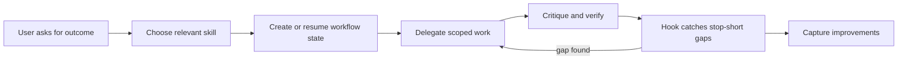
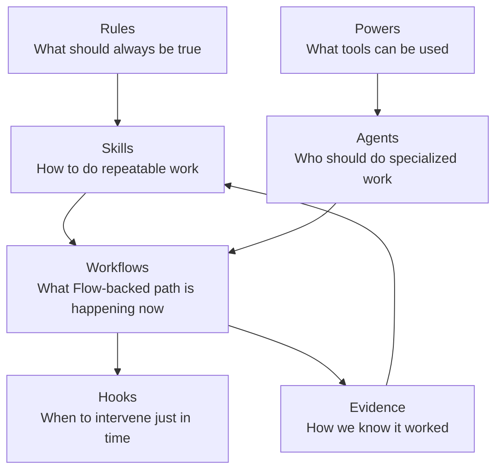
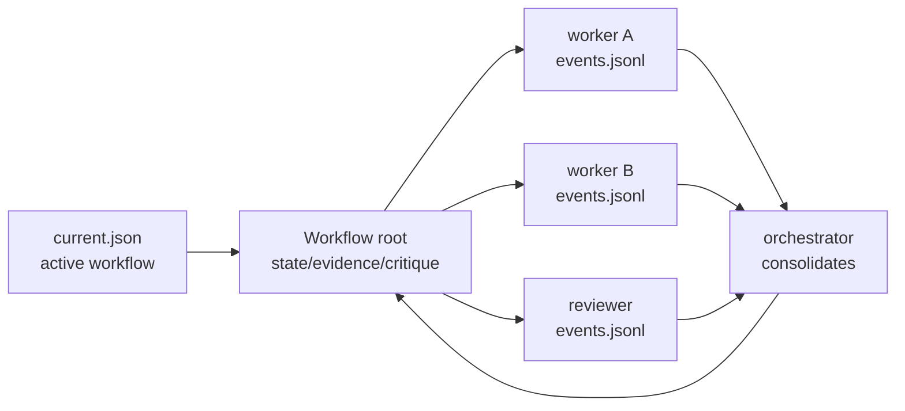
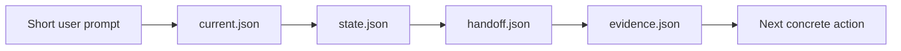

# Agent System Guidebook

This is the plain-language map of how Flow Agents is assembled and how it should feel to use.

> **Which doc do I want?** This page explains *how the system thinks* — layers, state, hooks, evidence, and the UX rules behind them. If you want to *drive a workflow right now* — stage-by-stage prompts and expected behavior — use the [Workflow Usage Guide](workflow-usage-guide.md). For the one-line summary of every skill and gate, use the [Skills Map](skills-map.md).

The short version: Flow Agents is not one large prompt. It is a portable operating layer that wraps agent runtimes with durable instructions, task-specific procedures, scoped tools, specialist agents, Flow-backed workflow state, hooks, evidence, and learning loops. The goal is to make ordinary agent use more reliable without asking the user to understand all of that machinery.

## The User Experience

The user should be able to speak naturally:

```text
Plan this out and start making it happen. Keep going until the work is done.
```

Flow Agents should translate that into a disciplined workflow:



The user sees a simple conversation. Underneath, the system keeps track of what is being done, who is doing it, how it will be checked, what is still missing, and what should improve next time. Generic process enforcement belongs to Kontour Flow; Flow Agents makes that enforcement native inside agent harnesses.

## The Simple Model

Think of Flow Agents as three visible ideas and four hidden supports.

<div class="concept-strip">
  <section>
    <strong>Ask</strong>
    <span>The user states the outcome in normal language.</span>
  </section>
  <section>
    <strong>Work</strong>
    <span>The agent plans, delegates, edits, researches, or captures knowledge.</span>
  </section>
  <section>
    <strong>Prove</strong>
    <span>The system checks whether the result is actually done.</span>
  </section>
</div>

The hidden supports are:

| Support | Plain-English Job |
| --- | --- |
| Instructions | Remember the rules and defaults the user should not have to repeat. |
| Procedures | Load the right playbook for the task at hand. |
| State | Remember the active workflow even after long context or multiple agents. |
| Evidence | Require proof, critique, or an explicit gap before calling work done. |

## What The User Says Vs What Flow Agents Does

| User Says | Flow Agents Should Do |
| --- | --- |
| “Research this and narrow focus.” | Use research/ideation skills, collect patterns, identify standards, and turn broad ideas into a smaller direction. |
| “Plan it out and start making it happen.” | Create a workflow artifact, define acceptance criteria, plan execution, then start implementation. |
| “Keep going until nothing is left.” | Use hooks and workflow state to avoid stopping early, then continue through verification and docs. |
| “Use subagents to critique.” | Delegate critique as report-only work, record findings, fix failures, and re-run verification. |
| “Can we validate this on Flow Agents itself?” | Use Flow Agents artifacts, hooks, evals, and learning loops on Flow Agents itself. |
| “What slug are we on?” | Resolve `.kontourai/flow-agents/current.json`; do not depend on memory from chat. |

## Mental Model

Flow Agents works like an agent workbench with seven cooperating layers:

| Layer | What It Means | Where It Lives |
| --- | --- | --- |
| Rules | Durable behavior that should apply before a task starts. | `AGENTS.md`, `context/` |
| Skills | Repeatable procedures the agent loads only when relevant. | `skills/*/SKILL.md` |
| Powers | Tool bundles and activation guidance for integrations. | `powers/` |
| Agents | Specialist roles with scoped responsibilities. | `agents/`, `agent-cards/` |
| Workflows | State, gates, handoffs, and task memory. | Kontour Flow concepts, `.flow-agents/`, `npm run workflow:sidecar --` |
| Hooks | Just-in-time reminders or blockers from current workflow state. | `scripts/hooks/`, exported runtime configs |
| Evidence | Tests, evals, telemetry, findings, and outcome records. | `evals/`, `.telemetry/`, sidecars |

Each layer should stay small enough to explain independently. When the system feels complicated, the fix is usually to move behavior to the right layer, not to add more global prompt text.



## What We Actually Built

### Portable Source

The repo root is the canonical source. Generated bundles under `dist/` are outputs, not editing targets. The source files are exported into Codex, Claude Code, and Kiro shapes so each runtime receives the same operating system through its native conventions.

The important source areas are:

| Path | Purpose |
| --- | --- |
| `AGENTS.md` | Repo-level agent rules and source-of-truth instructions. |
| `skills/` | Procedure packages such as `plan-work`, `execute-plan`, `verify-work`, and knowledge workflows. |
| `agents/` | Specialist role definitions and tool boundaries. |
| `context/contracts/` | Shared workflow contracts for planning, execution, verification, delivery, sandboxing, and governance adapters. |
| `scripts/` | Build, validation, hook, telemetry, and sidecar tooling. |
| `evals/` | Static, behavioral, integration, and bundle-install tests. |
| `packaging/` | Cross-runtime export manifest and packaging rules. |
| `docs/` | Durable explanation of the operating model and roadmap. |

Flow Agents currently carries local workflow sidecars and hooks while Flow is being separated into its own Kontour product layer. The intended boundary is that Flow owns generic steps, gates, transitions, Flow Runs, exceptions, and Flow Reports; Flow Agents owns the agent-facing modes, skills, provider settings, runtime adapters, and Console experience that make those flows useful.

### Skills

Skills are the reusable procedures. They are intentionally more specific than broad rules and lighter than a full app.

For example:

- `plan-work` turns a goal into a concrete plan with acceptance criteria and file ownership.
- `execute-plan` coordinates implementation from that plan.
- `verify-work` gathers evidence and reports gaps.
- `deliver` chains planning, execution, review, verification, goal fit, and final acceptance.

The pattern is: put a repeatable procedure in a skill, then make activation explicit enough that the agent can load it just in time.

### Agents

Agents are specialist roles, not miscellaneous prompts. A good agent has a narrow job and a clear report boundary.

Examples:

- `tool-planner` produces execution plans but does not edit files.
- `tool-worker` edits source within assigned ownership.
- `tool-verifier` runs checks and reports evidence without fixing code.
- `tool-code-reviewer` critiques quality and maintainability.
- `tool-security-reviewer` checks security risk.

The orchestrator owns coordination. Specialists should not quietly rewrite the whole workflow state because that makes parallel work hard to trust.

### Workflows And Sidecars

Workflow artifacts live under:

```text
.flow-agents/<task-slug>/
```

The Markdown artifact is the human-readable session record. JSON sidecars are the machine-readable state:

These artifacts are the current Flow Agents implementation surface for Flow-backed workflow state. As Flow matures, Flow Agents should map these sidecars to Flow Runs and Flow Reports instead of inventing a separate generic enforcement model.

| Sidecar | Purpose |
| --- | --- |
| `state.json` | Current phase, status, next action, and artifact refs. |
| `acceptance.json` | Acceptance criteria and goal-fit status. |
| `handoff.json` | Summary, blockers, warnings, and next steps. |
| `evidence.json` | Checks, verdicts, and `NOT_VERIFIED` gaps. |
| `critique.json` | Review findings and pass/fail critique state. |
| `release.json` | Merge, release, deploy, hold, or rollback readiness. |
| `learning.json` | Post-work lessons and routed follow-ups. |

Runtime writes to `state.json` and `handoff.json` go through the sidecar transition guard in `npm run workflow:sidecar --`. The guard is an interim Flow Definition-compatible adapter: it can read the Builder Kit `builder.build` Flow Definition shape for step order, route-back reasons, and route-back max attempts, and it falls back to a legacy-compatible direct primitive policy when no Builder Kit workflow metadata is present. Flow remains the owner of transition semantics; this adapter exists only to fail closed until Flow core exposes the authoritative transition validator.

Rejected transitions do not rewrite `state.json` or `handoff.json`. The writer appends structured diagnostics to `transition-diagnostics.jsonl` beside the workflow sidecars, including the command, actor, from/to phase and status, Flow Definition id, route-back reason, attempt details when relevant, and required downstream gates. Route-back loop accounting is stored separately in `transition-attempts.json`, not in `state.json`, so the authoritative workflow state stays schema-clean.

The sidecar writer is the main helper:

```bash
npm run workflow:sidecar -- ensure-session ...
npm run workflow:sidecar -- current --format path
npm run workflow:sidecar -- record-agent-event ...
```

`ensure-session` creates or selects the workflow and writes `.kontourai/flow-agents/current.json`. `current` resolves the active workflow path. `record-agent-event` lets parallel workers append progress to `agents/<agent-id>/events.jsonl` without guessing the slug.

This is the key answer to multi-agent coordination: agents should not rely on conversational memory for the current slug. The orchestrator resolves the active workflow and passes the path to delegates. Delegates append events. The orchestrator consolidates those events into root state, evidence, critique, and handoff.



This keeps the UX simple in a multi-agent session. The user does not manage slugs, artifact paths, or worker state. The orchestrator resolves the active workflow and gives each delegate the right place to report.

### Hooks

Hooks are the just-in-time guidance layer.

They inspect current workflow state and remind or block at the moment the agent is about to drift, stop early, or lose useful process state. The current hook surface includes:

- goal-fit checks before stopping
- ambient workflow steering at user prompt submit
- phase-transition steering after delegated subagent tool use
- runtime adapters for Codex, Claude Code, and Kiro
- strict modes for requiring sidecars or critique records

The reason hooks matter is that they keep guidance active even when the context window is crowded or the model is no longer tracking the original plan well.

### Evals

Evals are how we keep this from becoming vibes.

The repo has tests for:

- source-tree validity
- workflow skill contracts
- artifact and sidecar schema behavior
- hook output for Codex, Claude Code, and Kiro
- bundle install smoke tests
- telemetry import/report/dashboard behavior
- context-map drift
- workflow sidecar races, including late parallel-agent events

The intended pattern is that every important workflow rule gets a test at the lowest useful layer: static checks for text contracts, integration checks for scripts and hooks, and behavioral evals for runtime agent behavior when practical.

### Neutral base and Kits

Every install ships the full standalone base — the `skills/`, `agents/`, and `powers/` directories are the neutral multi-framework toolbox, always present and never filtered at install time.

Opinion and depth live in Flow Kits (builder, knowledge, release-evidence), surfaced through the Kit Catalog and activated when a workflow needs them. The Kit Catalog is the product-facing vocabulary; the standalone base is the doer's toolbox.

## How A Request Flows

For a serious development task, the intended flow is:

```text
user request
  -> rules establish boundaries
  -> relevant skill loads
  -> workflow session is created or resumed
  -> planner defines acceptance criteria
  -> workers implement scoped pieces
  -> reviewers critique without fixing
  -> verifiers collect evidence without fixing
  -> hooks prevent premature stopping
  -> evidence gate decides pass/fail/not verified
  -> release readiness decides merge/release/deploy/hold
  -> learning review routes improvements back into docs, evals, skills, or backlog
```


## Example: Development Work

For development work — session, plan, execute, critique, verify, document, commit — the stage-by-stage walkthrough with example prompts and expected behavior lives in the [Workflow Usage Guide](workflow-usage-guide.md). The UX contract is the same as everywhere else in this guidebook: the user states the outcome, and the system supplies the path, the state, the checks, and the proof.

## Example: Meeting Or Sales Knowledge

User prompt:

```text
Prepare me for this customer call and remember the follow-ups afterward.
```

What Flow Agents should do:

| Step | What Happens | What The User Should Notice |
| --- | --- | --- |
| 1. Gather | Search notes, calendar, contacts, transcripts, and account context. | Relevant history appears without manual digging. |
| 2. Synthesize | Summarize people, open loops, decisions, risks, and likely agenda. | The prep is short but grounded. |
| 3. Capture | Turn meeting notes into durable knowledge afterward. | Follow-ups and decisions are not lost. |
| 4. Link | Connect people, orgs, prior calls, and commitments. | Future prep gets better. |
| 5. Learn | Route repeated gaps into docs, skills, or source integrations. | The system improves without hidden magic. |

The same UX principle applies: the user asks for the outcome; Flow Agents chooses the support structure.

## Example: Context Is Full

User prompt:

```text
Keep going. Do whatever is next.
```

What should happen:



The agent should not reconstruct the session from memory. It should resolve the active workflow from `.kontourai/flow-agents/current.json`, read the sidecars, and continue from the recorded next action. If evidence is missing, it should say `NOT_VERIFIED` or keep working. If critique is open, it should fix or route the finding. If everything is clean, it can deliver.

## One-Page Cheat Sheet

| If You Want | Say This | Flow Agents Should |
| --- | --- | --- |
| Shape an idea | “Research this and narrow focus.” | Find patterns, standards, risks, and the thinnest useful slice. |
| Build something | “Plan it out and start making it happen.” | Create workflow state, plan, execute, critique, verify, and document. |
| Continue autonomously | “Keep going until nothing is left.” | Use sidecars and hooks to find the next action without relying on chat memory. |
| Use parallel help | “Delegate critique while you continue.” | Give agents the workflow root and collect append-only events. |
| Prove it worked | “Do not stop until it is verified.” | Map acceptance criteria to checks, evidence, and remaining gaps. |
| Improve the system | “Validate this on Flow Agents itself.” | Use `dogfood-pass` to record evidence, critique, state, handoff, and routed learning. |

## Good UX Rules

- The first screen should answer “what can I ask this to do?”
- The user should not need to know whether a capability is a rule, skill, hook, power, or agent.
- The system should expose evidence and gaps in plain language.
- Advanced detail should be inspectable, not mandatory.
- The workflow should continue when safe, pause when evidence is missing, and explain exactly why.
- Defaults should be conservative, but the user should be able to opt into more autonomy.
- Long-running work should survive context compaction, restarts, and parallel agents.

## Design Rules I Used

When I changed the system, I interpreted the architecture this way:

- Keep the user-facing surface simple: the user asks for an outcome, not a workflow lecture.
- Keep durable state outside the model context so work survives compaction and long sessions.
- Keep root workflow state owned by the orchestrator so parallel workers do not overwrite each other.
- Let delegates append events instead of editing shared state directly.
- Prefer JSON Schema, OpenTelemetry, SARIF, MCP, OpenAPI, OAuth/OIDC, CommonMark, and other standards before inventing formats.
- Add Flow Agents-owned formats only when they are small, versioned, inspectable, and validated.
- Treat `NOT_VERIFIED` as a real result, not a failure to write a confident answer.
- Add hooks where timing matters and skills where procedure matters.
- Add evals for behavior that we expect future agents to preserve.
- Promote useful working artifacts into durable docs once the pattern matters beyond one task.

## What Good Looks Like

Flow Agents is working when:

- an agent can resume the right task without remembering the slug from chat
- parallel agents can report progress without corrupting shared state
- hooks nudge the agent before it stops short
- verification evidence maps back to the original user outcome
- docs explain the workflow without requiring code spelunking
- repeated corrections become tests, skills, rules, docs, or backlog items
- the same bundle works across Codex, Claude Code, and Kiro

## Where This Still Needs To Grow

The next useful improvements are:

- stronger live behavioral evals that prove hook output changes agent behavior across every runtime, not only that hooks emit guidance
- richer guide examples for non-code knowledge workflows
- clearer Kit Catalog activation guidance for global installs
- a Veritas advisory-readiness spike through the optional governance adapter boundary
- a self-validation loop that automatically proposes docs, eval, or skill updates after repeated workflow friction

The north star is not more ceremony. It is reliable autonomy: the system should quietly keep the agent on track while the user stays focused on the work they actually wanted done.
