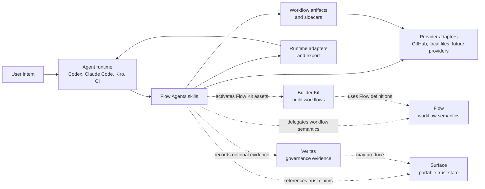
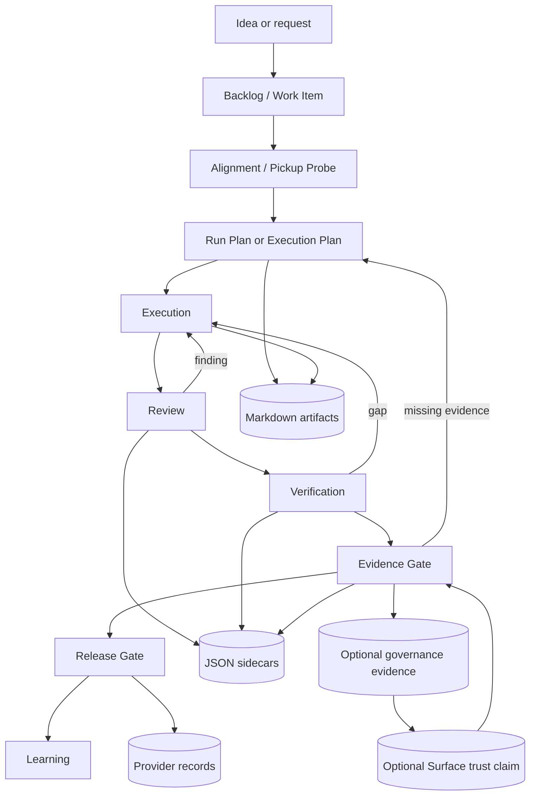

# Developer Architecture

This guide is the local starting point for Flow Agents maintainers who need to understand how this repository coordinates with Flow, Surface, Veritas, and Builder Kit. It describes the architecture from the Flow Agents side only; product-specific runtime details remain in their owning products.

## Orientation

Flow Agents is the agent-facing operating layer. It turns a user's intent into workflow skills, local artifacts, sidecars, checks, and handoffs that a human or another agent can inspect later.

**Current state:** Flow Agents owns the portable agent bundle, skills, contracts, local workflow artifacts, runtime-specific exports, provider wiring, and validation scripts in this repository.

**Future direction:** Flow, Surface, Veritas, Builder Kit, and other Kontour products should continue converging on shared resource shapes and gate vocabulary without making this repository the owner of every product's runtime semantics.

Use these local references when you need more detail:

- [Context glossary](../CONTEXT.md) defines Flow Agents vocabulary.
- [Repository Structure](repository-structure.md) is the canonical map for source, generated output, runtime state, packaging, eval, and cleanup boundaries.
- [ADR 0003](adr/0003-flow-agents-coordinates-kits-and-adapters.md) records the kit and adapter boundary.
- [ADR 0005](adr/0005-kubernetes-inspired-resource-contracts.md) records the Kontour Resource Contract direction.
- [Kontour Resource Contract](kontour-resource-contract.md) documents the shared durable record shape.
- [Flow Kit Repository Contract](flow-kit-repository-contract.md) documents local kit validation and activation boundaries.
- [Veritas Integration Boundary](veritas-integration.md) records the early integration rationale; the shipped path is the external **Veritas Governance Kit** in [`kontourai/veritas`](https://github.com/kontourai/veritas), installed through the same Git repository contract as any other kit. See [Engine and kits](architecture-engine-and-kits.md).

## Coordination Map



**Current state:** Flow Agents coordinates local agent workflows with Markdown session artifacts, JSON sidecars, scripts, evals, and local docs. It validates Flow Kit repository shape and activates supported local Flow Definition assets for the implemented `codex-local` adapter.

**Future direction:** Flow should own authoritative workflow semantics, route decisions, gate enforcement, and Flow Definition validation. Flow Agents should stay the projection layer that makes those workflows usable inside agent runtimes and provider-backed workspaces.

## Ownership Boundaries

| Product | Owns | Flow Agents boundary |
| --- | --- | --- |
| Flow Agents | Agent-facing workflow bundles, skills, sidecars, artifact contracts, evals, runtime export, provider wiring, and local-first docs. | Does not become the core workflow engine for all Kontour products and should not copy product-native rule models into this repo. |
| Flow | Generic workflow semantics, Flow Definitions, gate transitions, attempts, route-back behavior, Flow Runs, and Flow Reports. | Flow Agents may consume or project Flow concepts, but Flow owns enforcement semantics once the Flow surface is available. |
| Builder Kit | The first Kontour-authored Flow Kit for build work: shaping, pickup probes, planning, execution, review, verification, publication, release readiness, and learning workflows. | Flow Agents validates, installs, activates, and routes Builder Kit assets; it does not make every Builder Kit specialization a core Flow Agents concept. |
| Veritas | The repo-local governance **evaluation engine** (`@kontourai/veritas`) and its external **Veritas Governance Kit**: repo standards, authority settings, policy/rule checks, setup guidance, and canonical readiness trust bundles. | Flow Agents installs the Veritas repository as a normal Git-backed Flow Kit, activates its supported assets, and hosts its generic gates. It neither bundles Veritas nor imports or reimplements its rules. |
| Surface | Portable trust state, claims, TrustReports, Trust Snapshots, and user-facing trust surfaces. | Flow Agents can reference Surface-shaped claims for gates, but Surface owns claim models and trust presentation. |

**Current state:** Builder Kit is the first proof point for extracting out-of-the-box behavior into normal Flow Kits. Veritas is consumed through the external **Veritas Governance Kit** at the root of the [`kontourai/veritas`](https://github.com/kontourai/veritas) repository. The kit wraps the standalone `veritas` CLI and gates its canonical trust bundle; Flow Agents remains the neutral kit host.

**Future direction:** Flow Agents should support more runtime adapters, provider adapters, and Flow Kits without forcing all users to install Builder Kit, Veritas, Surface, or a specific hosted provider.

## Artifact And Evidence Flow



**Current state:** The durable handoff surface is a pair of human-readable Markdown artifacts and machine-readable JSON sidecars under `.kontourai/flow-agents/<slug>/`. Verification, critique, release, and learning records are explicit artifacts rather than hidden chat memory.

**Programmatic API (for native hosts):** The canonical Builder runtime and sidecar writer/validator remain importable from the package root so a native host does not reimplement validated workflow mutation. Agent-facing Kit guidance uses the public `flow-agents workflow` command so gate ownership, assignment checks, command observation, and projection happen through one portable interface:

```js
import {
  validateTrustBundle,   // Hachure trust.bundle validation (the writer's validator)
  normalizeCheck,        // validate + normalize an evidence check (throws on invalid)
  normalizeLearning,     // validate + normalize a learning record
  validateEvidenceRef,   // validate a structured evidence reference
  readSidecar, writeSidecar, sidecarBase, writeState,
} from "@kontourai/flow-agents";
```

This is the same code the CLI runs; importing it does not execute the CLI. The sidecar JSON Schemas under `schemas/` remain the normative shape.

**Future direction:** Durable workflow state should converge toward Kontour Resource Contracts with versioned identity, desired state, observed status, and condition summaries. That convergence should preserve local files and provider-backed records as first-class surfaces.

## Local Workflow Roles

Flow Agents workflows separate selection, planning, execution, critique, verification, evidence, release, and learning so each stage leaves inspectable state.

**Current state:**

- `pull-work` selects work, checks WIP and dependency context, and records the pickup decision.
- `plan-work` produces an execution plan with acceptance criteria, scope, risks, and verification expectations.
- `execute-plan` implements the approved plan and records modified files.
- `review-work` and `verify-work` produce report-only critique and evidence.
- `evidence-gate`, `release-readiness`, and `learning-review` decide whether the work is trustworthy, acceptable, and worth feeding back into the system.

**Future direction:** Flow-owned runs and gates should be able to supply the same structure to local agents, CI agents, and hosted control planes without depending on a particular chat runtime.

## Resource Contract Alignment

Kontour Resource Contracts provide the shared shape for durable records that cross product or adapter boundaries.

**Current state:** Flow Agents already uses local workflow artifacts and sidecars as the operational handoff surface. New shared contracts should prefer the Kontour Resource Contract shape unless a product records a specific exception.

**Future direction:** Active Workflow Runs, Selected Scope, Gate status, provider evidence, Surface claims, and Veritas report pointers should become easier to compare because they use compatible identity, metadata, desired intent, observed status, and condition-style summaries.

## Reading Order For Contributors

Start here, then follow the local docs in this order:

1. [Workflow Usage Guide](workflow-usage-guide.md) for the user-facing delivery path.
2. [Repository Structure](repository-structure.md) for where changes belong and what is generated or runtime-only.
3. [Skills Map](skills-map.md) for workflow phase composition.
4. [Workflow Artifact Lifecycle](workflow-artifact-lifecycle.md) for what stays local, what gets promoted, and what must not be merged.
5. [Flow Kit Repository Contract](flow-kit-repository-contract.md) for kit repository validation and activation behavior.
6. [Veritas Integration Boundary](veritas-integration.md) for optional governance evidence.
7. [Developer Reference](context-map.md) for generated repository structure, commands, agents, skills, scripts, and contracts.
