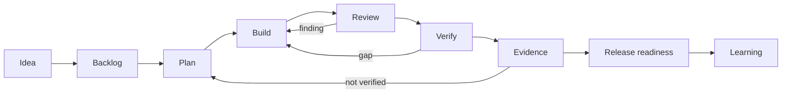

# Flow Agents

<p class="home-lede">A portable process-discipline layer for agentic work: canonical policies, evidence, and telemetry that compile to whatever hook surface a host exposes — coding-agent harnesses today, agent frameworks next. Flow Agents keeps work inspectable from idea to release readiness so you ask for outcomes and the system supplies the path, the state, the checks, and the proof.</p>

<div class="value-grid">
  <section>
    <strong>Four canonical policies</strong>
    <span>Workflow steering, quality gate, stop-goal-fit, and config protection — each a canonical script under <code>scripts/hooks/</code> that compiles to the host's native hook format. Claude Code and Codex are the L2 reference implementations.</span>
  </section>
  <section>
    <strong>Survive context loss</strong>
    <span>Durable sidecar state under <code>.flow-agents/</code> records acceptance criteria, evidence, critique, and handoff, so any session resumes from recorded state instead of chat memory.</span>
  </section>
  <section>
    <strong>Evidence over confidence</strong>
    <span>Hooks catch stop-short behavior, and important work ends with tests, browser checks, CI results, review findings, or an explicit <code>NOT_VERIFIED</code> gap — never just a confident summary.</span>
  </section>
  <section>
    <strong>Flow Kits — workflow + output shape</strong>
    <span>A kit bundles a workflow and its opinionated output shape as a validated, installable unit. Two reference kits ship today: Builder Kit (shaping → delivery pipeline) and Knowledge Kit (gated store with five pipeline flows, pluggable adapters, and an Obsidian rendering layer). <a href="kit-authoring-guide.html">Author your own</a> using the same path.</span>
  </section>
</div>

## How it works



Flow Agents adds the operating layer around the model: skills choose the right workflow, sidecars preserve state, hooks enforce the four canonical policies, and evals keep the bundle honest as it changes. The gate semantics underneath — definitions, runs, evidence, route-back — belong to <a href="https://kontourai.github.io/flow/">Kontour Flow</a>; Flow Agents compiles those policies to whatever hook surface a host exposes.

## Process-discipline layer

The four canonical policy classes are defined in the <a href="spec/runtime-hook-surface.html">Runtime Hook Surface spec</a> using a runtime-neutral vocabulary. Adapters translate them to the host's native hook format at three conformance levels: <strong>L0</strong> (telemetry only), <strong>L1</strong> (steering + stop-goal-fit warning), and <strong>L2</strong> (all four policies with blocking capability).

### Runtime and support matrix

| Tier | Runtime | Ships | Conformance |
| --- | --- | --- | --- |
| Core harness | Claude Code | install + hooks + bundle | L2 — reference implementation |
| Core harness | Codex | install + hooks + bundle | L2 — reference implementation |
| Core harness | Kiro | install + hooks + bundle | L2 |
| Core harness | opencode | agents, skills, plugin, opencode.json | L1 — no prompt-submit hook |
| Core harness | pi | extension, skills, AGENTS.md | L1 — no stop hook |
| Official framework adapter | AWS Strands (Python) | `integrations/strands/` spike/preview | L0 + config protection via cancellation |
| Conformance-certified | Community / third-party | Self-certify | Conformance kit in development |

Documented gaps: opencode has no native `prompt.submit`-equivalent event; pi has no stop hook; Codex live hook influence on model context is limited. The <a href="spec/runtime-hook-surface.html">Runtime Hook Surface spec</a> names every gap explicitly using the canonical event taxonomy.

## Framework adapters

The same canonical policies wire into agent frameworks as in-process language-native packages. `integrations/strands/` contains `flow-agents-strands`, a Python `HookProvider` that emits the canonical telemetry taxonomy and enforces config protection via `BeforeToolCallEvent` cancellation — 50 unit tests, no Strands SDK required. This is a spike/preview. See <a href="spec/runtime-hook-surface.html">the spec</a> for the full framework adapter mapping and minimum viable adapter pseudocode.

## Quick Start

```bash
npx @kontourai/flow-agents init --dest /path/to/workspace
```

Runtime-specific installs:

```bash
npx @kontourai/flow-agents init --runtime claude-code --dest /path/to/workspace --yes
npx @kontourai/flow-agents init --runtime opencode --dest /path/to/workspace --yes
npx @kontourai/flow-agents init --runtime pi --dest /path/to/workspace --yes
```

Then ask for the workflow you want, in plain language:

```text
Use deliver for this GitHub issue. Plan it, implement it, review it, verify it, and stop if evidence is missing.
```

For bugs:

```text
Use fix-bug. Reproduce the problem, diagnose root cause, implement the fix, and verify the regression path.
```

## Explore the docs

<div class="doc-grid">
  <a class="doc-card" href="workflow-usage-guide.html">
    <strong>Workflow Usage Guide</strong>
    <span>Every stage from shaping ideas to learning review, with example prompts and expected behavior.</span>
  </a>
  <a class="doc-card" href="agent-system-guidebook.html">
    <strong>System Guidebook</strong>
    <span>The plain-language map of how Flow Agents is assembled and how it should feel to use.</span>
  </a>
  <a class="doc-card" href="skills-map.html">
    <strong>Workflow Map</strong>
    <span>See the core skills, gates, artifacts, and route-back behavior.</span>
  </a>
  <a class="doc-card" href="kit-authoring-guide.html">
    <strong>Kit Authoring Guide</strong>
    <span>Build your own Flow Kit from scratch: directory layout, kit.json, a flow file, validation, local install, and activation.</span>
  </a>
  <a class="doc-card" href="flow-kit-repository-contract.html">
    <strong>Flow Kit Repository Contract</strong>
    <span>Full validation rules, registry schema, activation diagnostics, and the install/update/force semantics.</span>
  </a>
  <a class="doc-card" href="knowledge-kit.html">
    <strong>Knowledge Kit</strong>
    <span>Gated knowledge storage with five pipeline flows, a representation-neutral store contract, default and Obsidian adapters, 198 tests, and a parameterized contract suite any adapter can run.</span>
  </a>
  <a class="doc-card" href="spec/runtime-hook-surface.html">
    <strong>Runtime Hook Surface</strong>
    <span>Canonical event taxonomy, four policy classes, conformance levels L0/L1/L2, and host mapping tables for adapter authors.</span>
  </a>
  <a class="doc-card" href="vision.html">
    <strong>Vision and Direction</strong>
    <span>The kits-as-ecosystem arc (authoring today → domain kits → registry → marketplace), TypeScript framework adapters, and Kontour Console as the unifying telemetry surface.</span>
  </a>
  <a class="doc-card" href="north-star.html">
    <strong>North Star</strong>
    <span>The product promise, design principles, operating layers, and roadmap.</span>
  </a>
  <a class="doc-card" href="developer-architecture.html">
    <strong>Developer Architecture</strong>
    <span>Flow Agents' coordination role, product boundaries, artifact flow, and cross-product vocabulary.</span>
  </a>
  <a class="doc-card" href="sandbox-policy.html">
    <strong>Safer Execution</strong>
    <span>Choose local, worktree, container, cloud, or privileged execution boundaries deliberately.</span>
  </a>
  <a class="doc-card" href="veritas-integration.html">
    <strong>Governance Evidence</strong>
    <span>Attach optional Veritas readiness reports without making governance tooling mandatory.</span>
  </a>
  <a class="doc-card" href="workflow-eval-strategy.html">
    <strong>Eval Strategy</strong>
    <span>How static, integration, behavioral, and artifact evals validate the bundle.</span>
  </a>
  <a class="doc-card" href="workflow-artifact-lifecycle.html">
    <strong>Artifact Lifecycle</strong>
    <span>Check in reviewable change work while promoting completed behavior into durable docs before merge.</span>
  </a>
  <a class="doc-card" href="work-item-adapters.html">
    <strong>Provider Adapters</strong>
    <span>Map provider-neutral work items, boards, published changes, checks, and evidence to GitHub-first adapters.</span>
  </a>
  <a class="doc-card" href="repository-structure.html">
    <strong>Repository Structure</strong>
    <span>The canonical source, generated output, runtime state, package, docs, eval, and cleanup boundaries.</span>
  </a>
  <a class="doc-card" href="kontour-resource-contract.html">
    <strong>Resource Contracts</strong>
    <span>The shared resource shape for durable workflow state and sidecars.</span>
  </a>
  <a class="doc-card" href="context-map.html">
    <strong>Developer Reference</strong>
    <span>The generated repo map: commands, agents, skills, scripts, and contracts.</span>
  </a>
  <a class="doc-card" href="integrations/index.html">
    <strong>Integration Examples</strong>
    <span>Worked examples for harness runtimes (Claude Code, opencode, pi), framework adapters (AWS Strands), and third-party self-certification with the conformance kit.</span>
  </a>
</div>

## The Kontour family

Kontour AI shows the work behind AI. <a href="https://kontourai.github.io/flow/">Flow</a> proves why a process was allowed to advance. <a href="https://kontourai.io/veritas">Veritas</a> makes AI-authored code changes inspectable. <a href="https://kontourai.io/survey">Survey</a> and <a href="https://kontourai.io/surface">Surface</a> carry the evidence underneath. Flow Agents packages those foundations into the agent tools you already use — so trustworthy autonomy doesn't require a perfect prompt, perfect memory, or a new runtime.

## Why it matters

Long-running agent work fails when the model loses context, skips verification, or calls partial work done. Flow Agents makes the process explicit without making the user write a perfect prompt every time. The agent gets a workflow; the developer gets artifacts they can inspect.
