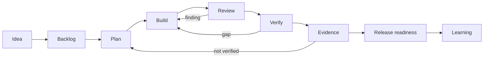

# Flow Agents

<p class="home-lede">Structured workflows for coding agents. Flow Agents helps Codex, Claude Code, Kiro, and CI agents keep work inspectable from idea to release readiness.</p>

<div class="value-grid">
  <section>
    <strong>Stay on the path</strong>
    <span>Turn loose requests into shaped work, plans, implementation waves, review, verification, and release decisions.</span>
  </section>
  <section>
    <strong>Show the evidence</strong>
    <span>Keep acceptance criteria, test results, browser checks, governance reports, and gaps in durable workflow artifacts.</span>
  </section>
  <section>
    <strong>Use your runtime</strong>
    <span>Install one bundle across Codex, Claude Code, Kiro, and local automation without rewriting the workflow for each tool.</span>
  </section>
</div>

## How It Works



Flow Agents adds the operating layer around the model: skills choose the right workflow, sidecars preserve state, hooks catch stop-short behavior, and evals keep the bundle honest as it changes.

## Quick Start

Install into a workspace:

```bash
bash install.sh /path/to/workspace
```

Then ask for the workflow you want:

```text
Use deliver for this GitHub issue. Plan it, implement it, review it, verify it, and stop if evidence is missing.
```

For bugs:

```text
Use fix-bug. Reproduce the problem, diagnose root cause, implement the fix, and verify the regression path.
```

## Use Cases

<div class="doc-grid">
  <a class="doc-card" href="workflow-usage-guide.html">
    <strong>Guided Delivery</strong>
    <span>Move from request to plan, implementation, review, verification, evidence, release readiness, and learning.</span>
  </a>
  <a class="doc-card" href="developer-architecture.html">
    <strong>Developer Architecture</strong>
    <span>Understand Flow Agents' coordination role, product boundaries, artifact flow, and cross-product vocabulary.</span>
  </a>
  <a class="doc-card" href="skills-map.html">
    <strong>Workflow Map</strong>
    <span>See the core skills, gates, artifacts, and route-back behavior.</span>
  </a>
  <a class="doc-card" href="sandbox-policy.html">
    <strong>Safer Execution</strong>
    <span>Choose local, worktree, container, cloud, or privileged execution boundaries deliberately.</span>
  </a>
  <a class="doc-card" href="veritas-integration.html">
    <strong>Governance Evidence</strong>
    <span>Attach optional Veritas readiness reports without making governance tooling mandatory.</span>
  </a>
  <a class="doc-card" href="context-map.html">
    <strong>Developer Reference</strong>
    <span>Inspect the generated repo map, commands, agents, skills, scripts, and contracts.</span>
  </a>
  <a class="doc-card" href="kontour-resource-contract.html">
    <strong>Resource Contracts</strong>
    <span>Read the shared resource shape for durable workflow state and sidecars.</span>
  </a>
  <a class="doc-card" href="workflow-eval-strategy.html">
    <strong>Eval Strategy</strong>
    <span>Understand how static, integration, behavioral, and artifact evals validate the bundle.</span>
  </a>
  <a class="doc-card" href="workflow-artifact-lifecycle.html">
    <strong>Artifact Lifecycle</strong>
    <span>Check in reviewable change work while promoting completed behavior into durable docs before merge.</span>
  </a>
  <a class="doc-card" href="work-item-adapters.html">
    <strong>Provider Adapters</strong>
    <span>Map provider-neutral work items, boards, published changes, checks, and evidence to GitHub-first adapters.</span>
  </a>
</div>

## Why It Matters

Long-running agent work fails when the model loses context, skips verification, or calls partial work done. Flow Agents makes the process explicit without making the user write a perfect prompt every time. The agent gets a workflow; the developer gets artifacts they can inspect.
