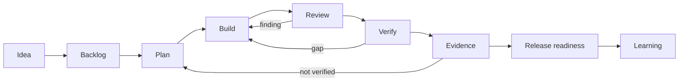

# Flow Agents

<p class="home-lede">Coding agents are powerful and forgetful. Flow Agents wraps Codex, Claude Code, Kiro, and CI agents in an operating layer that keeps long-running work inspectable — from idea to release readiness — so you ask for outcomes and the system supplies the path, the state, the checks, and the proof.</p>

<div class="value-grid">
  <section>
    <strong>Stay on the path</strong>
    <span>Turn loose requests into shaped work, plans, implementation waves, review, verification, evidence, and release decisions — the same workflow in every supported runtime.</span>
  </section>
  <section>
    <strong>Survive context loss</strong>
    <span>Durable sidecar state under <code>.flow-agents/</code> records acceptance criteria, evidence, critique, and handoff, so any session resumes from recorded state instead of chat memory.</span>
  </section>
  <section>
    <strong>Evidence over confidence</strong>
    <span>Hooks catch stop-short behavior, and important work ends with tests, browser checks, CI results, review findings, or an explicit <code>NOT_VERIFIED</code> gap — never just a confident summary.</span>
  </section>
</div>

## How it works



Flow Agents adds the operating layer around the model: skills choose the right workflow, sidecars preserve state, hooks catch stop-short behavior, and evals keep the bundle honest as it changes. The gate semantics underneath — definitions, runs, evidence, route-back — belong to <a href="https://kontourai.github.io/flow/">Kontour Flow</a>; Flow Agents makes that enforcement native inside agent harnesses.

## Quick Start

```bash
npx @kontourai/flow-agents init --dest /path/to/workspace
```


Then ask for the workflow you want, in plain language:

```text
Use deliver for this GitHub issue. Plan it, implement it, review it, verify it, and stop if evidence is missing.
```

For bugs:

```text
Use fix-bug. Reproduce the problem, diagnose root cause, implement the fix, and verify the regression path.
```

## Explore the docs

<div class="doc-grid">
  <a class="doc-card" href="workflow-usage-guide.html">
    <strong>Workflow Usage Guide</strong>
    <span>Every stage from shaping ideas to learning review, with example prompts and expected behavior.</span>
  </a>
  <a class="doc-card" href="agent-system-guidebook.html">
    <strong>System Guidebook</strong>
    <span>The plain-language map of how Flow Agents is assembled and how it should feel to use.</span>
  </a>
  <a class="doc-card" href="skills-map.html">
    <strong>Workflow Map</strong>
    <span>See the core skills, gates, artifacts, and route-back behavior.</span>
  </a>
  <a class="doc-card" href="north-star.html">
    <strong>North Star</strong>
    <span>The product promise, design principles, operating layers, and roadmap.</span>
  </a>
  <a class="doc-card" href="developer-architecture.html">
    <strong>Developer Architecture</strong>
    <span>Flow Agents' coordination role, product boundaries, artifact flow, and cross-product vocabulary.</span>
  </a>
  <a class="doc-card" href="sandbox-policy.html">
    <strong>Safer Execution</strong>
    <span>Choose local, worktree, container, cloud, or privileged execution boundaries deliberately.</span>
  </a>
  <a class="doc-card" href="veritas-integration.html">
    <strong>Governance Evidence</strong>
    <span>Attach optional Veritas readiness reports without making governance tooling mandatory.</span>
  </a>
  <a class="doc-card" href="workflow-eval-strategy.html">
    <strong>Eval Strategy</strong>
    <span>How static, integration, behavioral, and artifact evals validate the bundle.</span>
  </a>
  <a class="doc-card" href="workflow-artifact-lifecycle.html">
    <strong>Artifact Lifecycle</strong>
    <span>Check in reviewable change work while promoting completed behavior into durable docs before merge.</span>
  </a>
  <a class="doc-card" href="work-item-adapters.html">
    <strong>Provider Adapters</strong>
    <span>Map provider-neutral work items, boards, published changes, checks, and evidence to GitHub-first adapters.</span>
  </a>
  <a class="doc-card" href="repository-structure.html">
    <strong>Repository Structure</strong>
    <span>The canonical source, generated output, runtime state, package, docs, eval, and cleanup boundaries.</span>
  </a>
  <a class="doc-card" href="kontour-resource-contract.html">
    <strong>Resource Contracts</strong>
    <span>The shared resource shape for durable workflow state and sidecars.</span>
  </a>
  <a class="doc-card" href="context-map.html">
    <strong>Developer Reference</strong>
    <span>The generated repo map: commands, agents, skills, scripts, and contracts.</span>
  </a>
  <a class="doc-card" href="spec/runtime-hook-surface.html">
    <strong>Runtime Hook Surface</strong>
    <span>Canonical event taxonomy, policy classes, conformance levels, and host mapping tables for adapter authors.</span>
  </a>
</div>

## The Kontour family

Kontour AI shows the work behind AI. <a href="https://kontourai.github.io/flow/">Flow</a> proves why a process was allowed to advance. <a href="https://kontourai.io/veritas">Veritas</a> makes AI-authored code changes inspectable. <a href="https://kontourai.io/survey">Survey</a> and <a href="https://kontourai.io/surface">Surface</a> carry the evidence underneath. Flow Agents packages those foundations into the agent tools you already use — so trustworthy autonomy doesn't require a perfect prompt, perfect memory, or a new runtime.

## Why it matters

Long-running agent work fails when the model loses context, skips verification, or calls partial work done. Flow Agents makes the process explicit without making the user write a perfect prompt every time. The agent gets a workflow; the developer gets artifacts they can inspect.
