# Flow Agents Skills Map

This map groups the current skills by the user journey they support. The Builder Kit workflow system is centered on concrete workflow skills, while Flow Agents coordinates Flow Kit installation, runtime adapters, and local control.

For practical operator instructions and copy/paste prompts, see https://github.com/kontourai/flow-agents/blob/main/docs/workflow-usage-guide.md. For the shared cross-distribution contracts behind the workflow artifacts and gates, see https://github.com/kontourai/flow-agents/blob/main/docs/workflow-shared-contracts.md.

## Builder Skill Roles

`kits/builder/kit.json` is the machine-readable source for skill activation.
Flow Definitions own step order, gates, route-backs, and trust expectations;
the role matrix only maps each skill to that Flow-owned behavior.

For the Builder build flow, `execute` exposes only the declared correction
`plan_gap -> plan`, with Flow-owned bounded attempt accounting (three attempts,
then block). A skill or handoff cannot create that permission: `plan_gap` is valid
only while the active gate definition declares it, and status/sync do not backtrack.

| Role | Skills | Activation |
| --- | --- | --- |
| Entrypoint | `builder-shape`, `deliver` | User selects the Builder product workflow; the skill coordinates but owns no step evidence. |
| Profile | `fix-bug`, `tdd-workflow` | Explicit workflow variant; never selected as an automatic step action. |
| Step producer | `idea-to-backlog`, `pull-work`, `pickup-probe`, `plan-work`, `execute-plan`, `review-work`, `verify-work`, `evidence-gate`, `release-readiness`, `learning-review` | Activated only for its declared Flow step; publishes only its declared expectations. |
| Shared primitive | `design-probe` | Reused interview behavior with no Builder expectation ownership. |
| Extension | `continue-work`, `gate-review` | Explicit continuation or retrospective operation outside automatic step actions. |

Within the active `verify` step, `review-work` owns `clean-critique`: it records
a report-only critique slice in `trust.bundle`. `verify-work` owns
`acceptance-criteria`, `tests-evidence`, and applicable `policy-compliance`
through command-backed behavior evidence. Use the public `flow-agents workflow`
CLI for run status, evidence, and critique; skills must not call the
package-internal writer directly.

`builder.build` accepts exactly two public Work Item reference forms:
`provider:id` and `owner/repo#numeric-id`. The latter is the GitHub-compatible
adapter form; GitHub remains an optional adapter example. Do not invent
arbitrary reference formats.

- `builder-shape`: product-level Builder Kit shape invocation that guides `idea-to-backlog` without requiring the user to name the primitive, links `kits/builder/flows/shape.flow.json`, and stops at the backlog gate unless issue sync is explicit.
- `idea-to-backlog`: discovery, idea separation, thinnest meaningful slice, shaping, prioritization, and executable provider-backed work items; GitHub is an optional adapter.
- `pull-work`: dynamic backlog selection, grouping/dependency checks, WIP awareness, worktree decision, and execution handoff; in Builder Kit build, every selected item or justified group needs fresh pickup Probe evidence before planning.
- `design-probe`: generic one-question-at-a-time probing interview; Builder Kit uses this step before planning when the build flow needs shared understanding or a pickup decision.
- `pickup-probe`: Builder Kit specialization of `design-probe` for selected work items; records scope, provider state, WIP/conflict scans, risks, decisions, unresolved questions, accepted gaps, and planning readiness.
- `plan-work` / `execute-plan` / `deliver`: Definition Of Done, execution orchestration, and local delivery closure.
- `continue-work`: advance a multi-slice work item to its next increment via an ephemeral fresh-context handoff; derives the next undone slice from the Work Item plus completed changes, then routes it **through** `pull-work` + `pickup-probe` before handing off fresh per ADR 0013.
- `review-work`: report-only critique for quality, security triggers, architecture fit, and standards findings.
- `verify-work`: behavior evidence mapped to acceptance criteria and Goal Fit.
- `evidence-gate`: trust assessment for completed work: acceptance evidence, integrity checks, CI confidence, and next step.
- `release-readiness`: operational decisioning for a published change: merge/release/deploy/hold, rollback, observability, final acceptance docs, and post-deploy planning.
- `learning-review`: post-merge/post-deploy learning, follow-up routing, docs promotion checks, and durable knowledge capture.

```mermaid
flowchart LR
  Idea[Raw idea or goal]
  Shape[Builder Kit shape / idea-to-backlog<br/>shape executable work]
  Pickup[pull-work<br/>select ready work]
  Probe[design-probe / pickup-probe<br/>pickup Probe before planning]
  Build[plan-work + execute-plan<br/>build the slice]
  Review[review-work<br/>critique code and risk]
  Verify[verify-work<br/>prove behavior]
  GoalFit[goal-fit<br/>check user outcome]
  Trust[evidence-gate<br/>map criteria to evidence]
  Publish[publish-change<br/>commit / push / PR / CI]
  Release[release-readiness<br/>merge / release / deploy / docs decision]
  Learn[learning-review<br/>route follow-ups]
  Backlog[(Provider-backed work items)]

  Idea --> Shape --> Backlog --> Pickup --> Probe --> Build --> Review --> Verify --> GoalFit --> Trust --> Publish --> Release --> Learn
  Probe -->|not needed| Build
  Pickup -->|too vague or stale| Shape
  Review -->|findings| Build
  GoalFit -->|incomplete| Build
  Trust -->|FAIL / NOT_VERIFIED| Build
  Learn -->|new work| Shape
```

> `publish-change` is a CLI-driven workflow step, not a loadable skill.
> `goal-fit` is a hook-enforced check, not a loadable skill.

## Current Shape

The operating model now has first-class coverage from idea intake through trusted delivery:

- Upstream product work is exposed through `builder-shape` and owned by `idea-to-backlog`.
- Backlog selection and execution handoff are owned by `pull-work`.
- Design probing is a generic skill named `design-probe`; in the Builder Kit build flow the step is still named `design-probe`, and the `pickup-probe` specialization records selected-work readiness before planning. `decision_gap` route-backs return there for missing pickup/planning decisions.
- Product-level Builder Kit build may guide `pull-work -> design-probe / pickup-probe -> plan-work`; direct primitives still stop at their own gates and report the expected next step.
- Broad continuation language does not carry across newly selected work after merge. Queue inspection is allowed, but planning the next item requires a fresh pickup Probe record.
- Critique is owned by `review-work` as `clean-critique`, recorded directly by a delegated reviewer whose runtime identity differs from the active implementation actor, and stored through public `workflow critique` in its `trust.bundle` slice before verification.
- Verification is owned by `verify-work` as `acceptance-criteria`, `tests-evidence`, and applicable `policy-compliance`, recorded as command-backed `trust.bundle` evidence with one criterion JSON record for every accepted criterion.
- Trust evidence is assessed by `evidence-gate`; it decides whether completed work has enough proof and integrity to publish or continue fixing.
- Publishing verified changes is the bridge between evidence and release readiness: commit the verified diff, push the branch, open or update the PR, and collect PR/CI evidence.
- Merge/release/deploy decisioning is owned by `release-readiness` after the publish-change gate.
- Retrospective learning and follow-up routing are owned by `learning-review`.
- Implementation still flows through `plan-work`, `execute-plan`, `review-work`, and `verify-work`, with `Definition Of Done` and `Goal Fit Gate` preventing task-complete-but-user-incomplete delivery.
- Real browser/runtime checks remain delegated to `feedback-loop` and `browser-test`.

The upstream guardrail is intentionally strict: multiple ideas are inventoried separately first, the thinnest meaningful slice is identified for each buildable idea, and bundled work must have an explicit dependency or shared-outcome justification. The pickup workflow repeats this check before planning so unrelated backlog items do not silently become one implementation stream.

The intentionally deferred primitives such as `intake-idea`, `shape-work`, `test-map`, and `scope-and-integrity-check` are nested workflow sections for now. They should become separate skills only if their behavior grows enough to need independent contracts, artifacts, or eval suites.

## Phase Composition

This view shows how each phase is composed. The left rail is the durable phase sequence; each phase row names its primary owner, supporting skills, nested sections that may later become primitives, and the gate/artifact that lets the next phase begin.

<section class="phase-map" aria-label="Workflow phase composition">
  <article class="phase-row">
    
01<strong>Discovery & shaping</strong>

    

      <section class="phase-lane phase-lane--primary"><h3>Primary</h3>
<code>builder-shape</code> <code>idea-to-backlog</code>
</section>
      <section class="phase-lane"><h3>Support</h3>
<code>search-first</code> <code>explore</code> <code>frontend-design</code> optional <code>github-cli</code> adapter <code>knowledge-capture</code>
</section>
      <section class="phase-lane"><h3>Nested sections / future primitives</h3>
intake/dedupe, separate ideas, thinnest meaningful slice, opportunity review, explore options, <code>shape-work</code>, prioritize work, sync executable backlog
</section>
      <section class="phase-lane phase-lane--gate"><h3>Gate & artifact</h3>
Idea, slice, shape, and backlog gates. Writes shaped briefs and provider work-item refs in <code>.kontourai/flow-agents/&lt;slug&gt;/</code>.
</section>
    

  </article>
  <article class="phase-row">
    
02<strong>Backlog pickup</strong>

    

      <section class="phase-lane phase-lane--primary"><h3>Primary</h3>
<code>pull-work</code>
</section>
      <section class="phase-lane"><h3>Support</h3>
optional <code>github-cli</code> adapter
</section>
      <section class="phase-lane"><h3>Nested sections / future primitives</h3>
board snapshot, WIP check, grouping/dependency check, pickup Probe decision, worktree decision, <code>plan-work</code> handoff
</section>
      <section class="phase-lane phase-lane--gate"><h3>Gate & artifact</h3>
Pickup gate and pickup Probe handoff. Writes selected work items, blockers, bundle justification, provider state, accepted gaps, worktree policy, expected modified files, conflict risks, and handoff notes.
</section>
    

  </article>
  <article class="phase-row">
    
03<strong>Planning & build</strong>

    

      <section class="phase-lane phase-lane--primary"><h3>Primary</h3>
<code>plan-work</code> <code>execute-plan</code> <code>review-work</code> <code>verify-work</code>
</section>
      <section class="phase-lane"><h3>Support</h3>
<code>feedback-loop</code> <code>browser-test</code> <code>deliver</code> <code>fix-bug</code> <code>tdd-workflow</code>
</section>
      <section class="phase-lane"><h3>Nested sections / future primitives</h3>
Definition Of Done, execution plan, parallel waves, implementation session state, critique report, verification report, runtime/browser validation, Goal Fit Gate
</section>
      <section class="phase-lane phase-lane--gate"><h3>Gate & artifact</h3>
Review, verification, and Goal Fit gates. Produces critique findings plus test, build, lint, browser, or runtime evidence tied to acceptance criteria and the user-facing outcome.
</section>
    

  </article>
  <article class="phase-row">
    
04<strong>Evidence & release</strong>

    

      <section class="phase-lane phase-lane--primary"><h3>Primary</h3>
<code>evidence-gate</code> <code>release-readiness</code>
</section>
      <section class="phase-lane"><h3>Support</h3>
optional <code>github-cli</code> adapter <code>eval-rebuild</code>
</section>
      <section class="phase-lane"><h3>Nested sections / future primitives</h3>
criteria-to-evidence map, CI confidence, <code>scope-and-integrity-check</code>, publish-change, rollback review, observability review, post-deploy plan, final acceptance docs, remediate-ci
</section>
      <section class="phase-lane phase-lane--gate"><h3>Gate & artifact</h3>
Evidence, publish-change, release, and docs gates. Writes confidence, integrity, commit/branch/provider-change/CI links, release scope, risk, rollback, deploy-readiness decisions, and durable documentation links.
</section>
    

  </article>
  <article class="phase-row">
    
05<strong>Learning & improvement</strong>

    

      <section class="phase-lane phase-lane--primary"><h3>Primary</h3>
<code>learning-review</code>
</section>
      <section class="phase-lane"><h3>Support</h3>
<code>knowledge-capture</code> <code>idea-to-backlog</code> <code>eval-rebuild</code>
</section>
      <section class="phase-lane"><h3>Nested sections / future primitives</h3>
facts vs interpretation, follow-up routing, docs promotion review, knowledge updates, eval updates, skill/backlog improvements
</section>
      <section class="phase-lane phase-lane--gate"><h3>Gate & artifact</h3>
Learning gate. Writes outcomes, gaps, docs promotion state, follow-ups, knowledge updates, and verdict.
</section>
    

  </article>
</section>

| Phase | Primary workflow skill | Supporting skills | Nested sections / future primitive candidates |
| --- | --- | --- | --- |
| Idea discovery and shaping | `builder-shape`, `idea-to-backlog` | `search-first`, `explore`, `frontend-design`, optional `github-cli` adapter, `knowledge-capture` | intake/dedupe, separate ideas, thinnest meaningful slice, opportunity review, explore options, shape work, prioritize work, sync executable backlog |
| Backlog pickup | `pull-work` | optional `github-cli` adapter | board snapshot, WIP check, grouping/dependency check, Probe decision, worktree decision, handoff |
| Execution planning and build | `design-probe`, `pickup-probe`, `plan-work`, `execute-plan`, `review-work`, `verify-work` | `feedback-loop`, `browser-test`, `deliver`, `fix-bug`, `tdd-workflow` | Probe notes, Builder Kit Probe record, Definition Of Done, execution plan, parallel waves, implementation session state, critique report, verification report, Goal Fit Gate |
| Evidence and release confidence | `evidence-gate`, `release-readiness` | optional `github-cli` adapter, `eval-rebuild` | criteria-to-evidence map, CI confidence, scope/integrity check, publish-change, rollback review, observability review, final acceptance docs, post-deploy plan |
| Learning and improvement | `learning-review` | `knowledge-capture`, `idea-to-backlog`, `eval-rebuild` | facts vs interpretation, docs promotion review, follow-up routing, knowledge updates, eval/skill/backlog improvements |

The highest-leverage future extractions are likely `shape-work`, `test-map`, `scope-and-integrity-check`, and `remediate-ci`. They are still nested because their behavior is present, but not yet large enough to need separate activation contracts.

## Gates And Artifacts

Each workflow phase ends with an explicit gate and durable artifact:

- `builder-shape` selects a safe-slugged public shape run and delegates to `idea-to-backlog`.
- `idea-to-backlog` owns `<slug>--idea-to-backlog.md` and the `builder.shape` slices in `trust.bundle`.
- `pull-work` and `pickup-probe` own the selected-work and Probe sections of `<slug>--pull-work.md` plus their `trust.bundle` slices.
- `plan-work` owns `<slug>--plan-work.md`, `acceptance.json`, `handoff.json`, and its `trust.bundle` plan slice; `execute-plan` owns the session execution report, `state.json`, and its scope slice.
- `review-work` records report-only critique through public `workflow critique` and owns `clean-critique`.
- `verify-work` records command-backed `acceptance-criteria`, `tests-evidence`, and applicable `policy-compliance` evidence in `trust.bundle`.
- `evidence-gate` owns `<slug>--evidence-gate.md`; `release-readiness` owns `release.json`; `learning-review` owns `learning.json`; each also records its declared `trust.bundle` slice.

Core gates:

- Idea Gate: raw input is deduped, classified, and routed.
- Slice Gate: each candidate has one outcome, one thinnest meaningful slice, and explicit split/bundle/dependency reasoning.
- Shape Gate: scope, non-goals, risk, rollout notes, and acceptance criteria are stable enough.
- Backlog Gate: provider-backed work items represent executable or near-executable work; GitHub issues are an optional adapter example.
- Pickup Gate: selected work is ready, WIP is acceptable, and worktree policy is recorded.
- Review Gate: report-only reviewers have no open blocking findings, or findings are explicitly accepted/deferred/false positive.
- Verification Gate: implementation evidence exists from local, automated, browser, or runtime checks.
- Goal Fit Gate: the original user outcome is satisfied, gaps are explicit, and local/project/global scope is clear.
- Evidence Gate: acceptance criteria are mapped to falsifiable evidence and scope integrity is checked.
- Publish Change Gate: verified changes are committed, pushed, represented by a provider change record or explicit no-provider-change decision, and available provider checks/CI are linked.
- Release Gate: CI, docs, rollout, rollback, observability, and owner concerns are addressed for the risk class.
- Docs Gate: accepted planning artifacts are archived and promoted into durable docs when useful.
- Learning Gate: failures and recurring patterns are routed to tests, evals, skills, backlog, or knowledge capture.

## End-To-End Flow

```mermaid
flowchart LR
  Idea[Idea / vague goal]
  BacklogSkill[idea-to-backlog]
  Issue[Executable provider-backed work item]
  Pull[pull-work]
  Probe[design-probe]
  Worktree[worktree decision]
  Plan[plan-work]
  Execute[execute-plan]
  Review[review-work]
  Verify[verify-work]
  GoalFit[goal-fit]
  Evidence[evidence-gate]
  Publish[publish-change]
  Release[release-readiness]
  Docs[final acceptance docs]
  Learning[learning-review]
  Done[merged / shipped]

  Idea --> BacklogSkill --> Issue --> Pull --> Probe --> Worktree --> Plan --> Execute --> Review --> Verify --> GoalFit --> Evidence
  Evidence -->|PASS| Publish --> Release --> Done --> Docs --> Learning
  Review -->|findings| Execute
  GoalFit -->|incomplete| Plan
  Evidence -->|FAIL / NOT_VERIFIED| Plan
  Pull -->|too vague / stale| BacklogSkill
  Learning -->|systemic change| Eval[eval-rebuild / backlog / skill update]
```

> `publish-change` is a CLI-driven workflow step, not a loadable skill.
> `goal-fit` is a hook-enforced check, not a loadable skill.

## Eval Coverage

Workflow evals are layered to match this map:

- Static contract evals guard non-negotiable skill boundaries.
- Behavioral activation evals check that agents choose the right workflow and stop at gates.
- Artifact quality evals inspect durable session artifacts and provider work-item drafts; GitHub is an optional adapter example.
- Adversarial evals exercise premature coding, vague issues, missing CI, weakened tests, and prototype promotion risks.
- End-to-end evals cover `idea-to-backlog -> pull-work -> design-probe -> plan-work -> execute-plan -> review-work -> verify-work -> goal-fit -> evidence-gate` selectively.

This keeps one conversation capable of carrying the full operating loop while making each phase produce an artifact that the next phase can verify.
